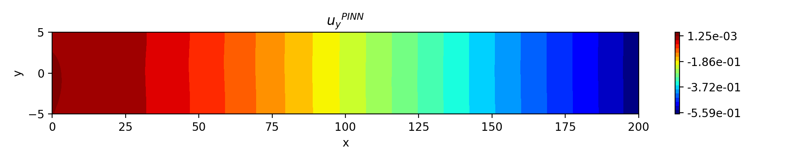
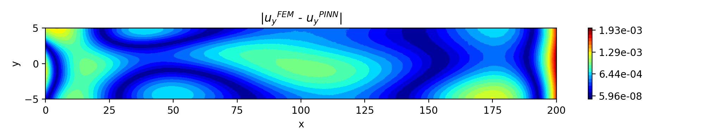

# Физически информированные нейронные сети в задачах динамики деформируемого твёрдого тела

##  Описание проекта:
Проект по разработке Physics-Informed Neural Network (PINN) для предсказания распределения напряжений и перемещений в задачах динамики деформируемого твёрдого тела.

## Содержимое 📂
- `2D_ProblemTrain.py` — реализация и обучения нейронной сети
- `2D_ProblemEVAL.py` — визуализация результатов и сравнение с численным решением
- `Plotting.py` —  модуль, в котором реализована функция для построения графиков
- `ResultFromANSYS.py` — модуль, в котором реализованы функции для загрузки данных, полученных с помощью программного обеспечения ANSYS
- `Models/` — директория, в которой хранятся обученные модели (на данный момент только модель для плоской задачи с импульсным нагружением)
- `ANSYS_Data/` — директория, в которой хранятся истинные перемещения и напряжения, полученный с помощью ANSYS (на данный момент только данные для плоской задачи с импульсным нагружением)
- `Детальное описание проекта/` — директория, в которой содержится детальное описание проекта
- `Литература/` — полезные материала о применении PINN в задачах механики
- `requirements.txt` — зависимости проекта
- `Images/` — примеры визуализаций

## Цели проекта :dart::
* Разработать и обучить PINN для задач динамики.
* Протестировать работу PINN и сравнить с численными методами решения задач механики (метод конечных элементов (МКЭ)).

## Заключение по итогам проекта:
1. Реализована и обучена физически информированная нейронная сеть.
2. Протестирована его работа на трёх задачах динамики деформируемого твердого тела.
3. Получена достаточно неплохая сходимость по перемещениям и плохая по напряжениям.

## Примеры визуализаций проекта:

   
  <b>График вертикальных перемещений, полученных с помощью МКЭ</b>

  <!-- небольшой отступ между картинками -->

   
  <b>График вертикальных перемещений, полученных с помощью PINN</b>

  <!-- небольшой отступ между картинками -->

   
  <b>Абсолютная разница в конкретный момент времени</b>

## Использованные инструменты и языки:
* Python
* Numpy
* Scipy
* Matplotlib
* Pytorch

## Направления деятельности:
* Глубокие нейронные сети
* PINN
* Численные методы
* Механика деформируемого твёрдого тела

